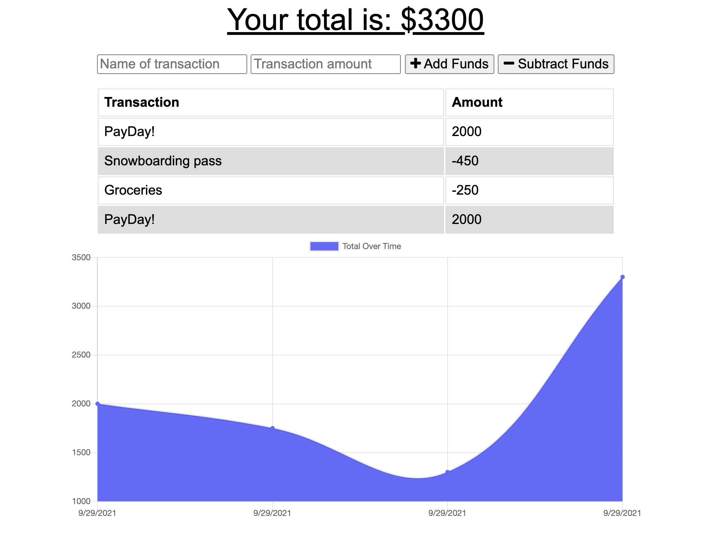

# Offline Budget App

LIVE URL: https://tech-blog-hh.herokuapp.com/

REPOSITORY: https://github.com/Hayden-Haun/Offline-Budget-App

## Table of Contents

- [Description](#description)
- [Installation](#installation)
- [Contributions](#contributions)
- [Usage](#usage)
- [Tests](#tests)
- [Technologies Used](#Technologies)
- [Credits](#credits)
- [Questions](#questions)

## Description

Track your finances offline in this Progressive Web Application. This features a manifest/service-worker which allows you to work offline and save your work via the browser's IndexedDB cache system . When internet is reconnected, the application will automatically sync with the MogngoDB database.

## Installation

    npm i

## Contributions

    Contact the owner

## Usage

    Launch Server: node server.js

## Tests

    none

## Technologies Used

    Caches, IndexedDB, Mongoose, MongoDB, Javascript, Progressive Web Application, Heroku

## Credits

    Hayden Haun

## Questions

    For additional questions, please contact GitHub user Hayden-Haun at haydenhaun@gmail.com
